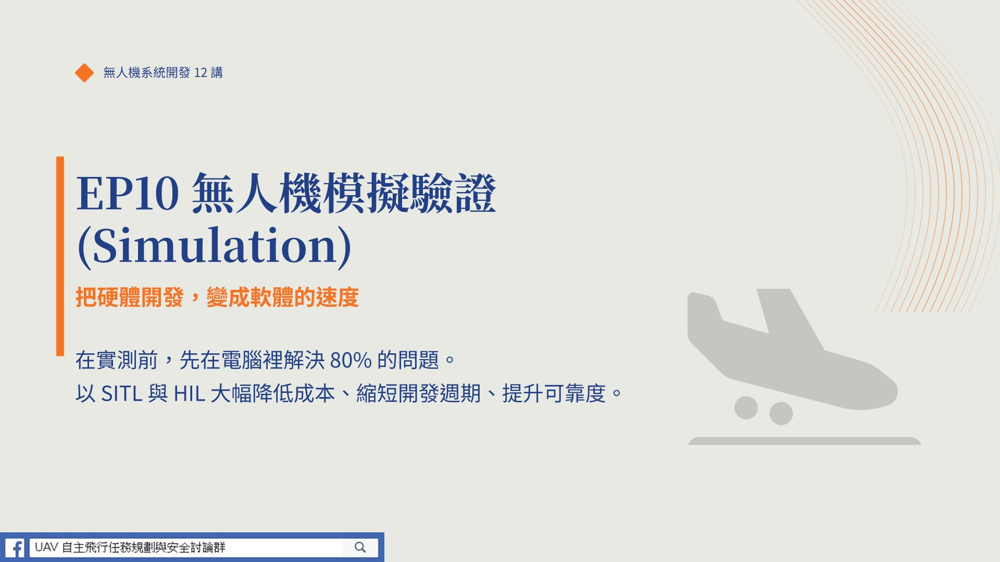

# EP10 — 一天摔一百架飛機：用 SITL/HIL 把研發成本砍半

(點選觀看影片)

大家好，我是阿仁。台灣很多無人機團隊的現狀是：**用硬體在除錯軟體，用新台幣在換取經驗值**——這不叫研發，這叫燒錢。如果有一種方法，可以讓你在辦公室吹冷氣，一天摔幾百架飛機、測各種極限狀況，不用花太多錢、不用申請空域、甚至連飛機都不用造出來，你信不信？這一集就是這個工具。

## 本集重點

### 1. SITL（Software In The Loop）——欺騙你的飛控軟體
把 ArduPilot/PX4 跑在 PC 上，用物理模擬引擎假裝風、重力、GPS 餵給它，它「完全不知道」自己在電腦裡。要測「低電量自動返航」？輸入一行指令把電壓設成 10.5V，飛控立刻觸發返航。SITL 讓邏輯驗證的成本趨近於零——真實世界測 10 次要兩天，SITL 一小時搞定。

### 2. HIL（Hardware In The Loop）——測硬體扛不扛得住
把「真的飛控板」插上 USB，電腦負責算物理環境，板子用「真的晶片」運算。SITL 測不出的問題它能測：EKF 演算法在 PC 跑很順，燒進飛控 CPU 直接 100% 導致控制延遲；或把板子丟進恆溫箱模擬 40 度高溫飛 5 小時。**SITL 測頭腦（邏輯對不對）、HIL 測身體（晶片夠不夠力）。**

### 3. 模擬是最高級的展示
要標丁型機的「群飛能力」，難道真的在投資人面前一次起飛 15 架？萬一撞民宅怎麼辦？拿出一套 SITL 模擬，在投影幕上展示 15 架機在虛擬戰場自動編隊、現場改參數模擬 5 號機被擊落、看機群動態補位——對評審的說服力絕對不亞於現場飛行。這證明的不是你會「造硬體」，而是你擁有「系統架構的掌控力」。

## 致謝

僅以這集，紀念我的恩師——**國立成功大學 航空太空工程學系 講座教授 蕭飛賓 老師**。老師的研究與教學，啟發了台灣無人機系統開發的第一代核心人才。

## 授權

本作品採 **CC BY 4.0** 授權。歡迎引用、分享與二次創作，請標註：**阿仁 — 無人機系統開發 12 講**。

---

## 講者介紹｜阿仁

**成功大學航太系所畢業、資深嵌入式系統開發工程師**

- 20 年無人機系統開發、整合與任務實戰經驗，專注於無人機系統開發領域
- 親自執行 240+ 政府委託任務，監督上千次飛行任務，累積豐富的實戰經驗
- 2023–2024 年參與多個商規軍用無人機專案，協助團隊成功拿下標案
- 本系列內容源自真實產業經驗與任務萃取，不是書本理論，而是實戰精華

**FB**　[UAV 無人機任務規劃與安全討論群](https://www.facebook.com/groups/1215514938555547)
**聯繫**　f44831324@gs.ncku.edu.tw
