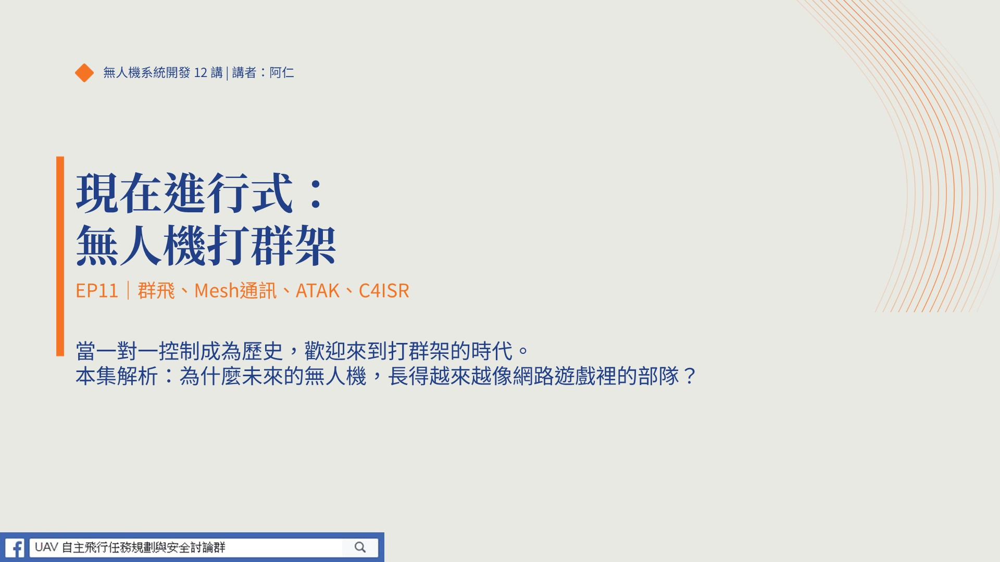

# EP11 — 從一對一駕駛到一對五十指揮：Mesh 網路與 ATAK 改寫戰場規則

(點選觀看影片)

大家好，我是阿仁。小時候玩《紅色警戒》《星海爭霸》，你不是一個人控制一隻小兵——你是圈選一整隊坦克，喊一聲 Attack 就把敵人淹沒。**這就是「指揮官」跟「駕駛員」的差別。** 過去十年無人機產業都在訓練駕駛員，但 2026 年規則徹底改了：未來的戰爭，不是單挑，是打群架。連美軍都開始大規模生產仿伊朗製低成本無人機群——因為用幾百萬美金飛彈打幾萬塊無人機是慢性自殺。

## 本集重點

### 1. 群飛的核心目的是「資訊優勢」，不是火力展示
單機是管中窺豹，群飛是上帝視角。要掃一座山，單機飛兩小時目標早跑了；10 架同時進入，得到的是「整座山的即時動態地圖」。不是仗著人多欺負人少，是在最短時間內獲取絕對資訊權。

### 2. Mesh Network——硬體可以便宜，但連結要強
每一架無人機既是戰鬥員，也是「空中基地台」。傳統架構炸掉地面站全斷線；Mesh 架構下，50 架低成本飛機衝向目標，只要一架突破干擾抓到訊號，就能把連線傳給整群隊友。**硬體像砲灰一樣消耗，通訊網路像喪屍群一樣死纏爛打**——這是美軍要的「集體韌性」。

### 3. ATAK 是大腦——軟體定義戰爭
ATAK（Android Team Awareness Kit）說穿了就是「軍事版 Google Maps + Line + 共享貼圖」。過去 3 個人伺候一架全球鷹，現在 1 個人指揮 50 架空中子彈。無人機點選目標，所有人平板上同步亮起紅點——這就是「共同作戰圖像（COP）」。Anduril 的 Lattice SDK 正在把這套架構從軍用擴展到邊境、港口、災難搜救：**未來的競爭不是比誰飛機造得好，而是比誰能當那個「作業系統」。**

## 致謝

僅以這集，紀念我的恩師——**國立成功大學 航空太空工程學系 講座教授 蕭飛賓 老師**。老師的研究與教學，啟發了台灣無人機系統開發的第一代核心人才。

## 授權

本作品採 **CC BY 4.0** 授權。歡迎引用、分享與二次創作，請標註：**阿仁 — 無人機系統開發 12 講**。

---

## 講者介紹｜阿仁

**成功大學航太系所畢業、資深嵌入式系統開發工程師**

- 20 年無人機系統開發、整合與任務實戰經驗，專注於無人機系統開發領域
- 親自執行 240+ 政府委託任務，監督上千次飛行任務，累積豐富的實戰經驗
- 2023–2024 年參與多個商規軍用無人機專案，協助團隊成功拿下標案
- 本系列內容源自真實產業經驗與任務萃取，不是書本理論，而是實戰精華

**FB**　[UAV 無人機任務規劃與安全討論群](https://www.facebook.com/groups/1215514938555547)
**聯繫**　f44831324@gs.ncku.edu.tw
