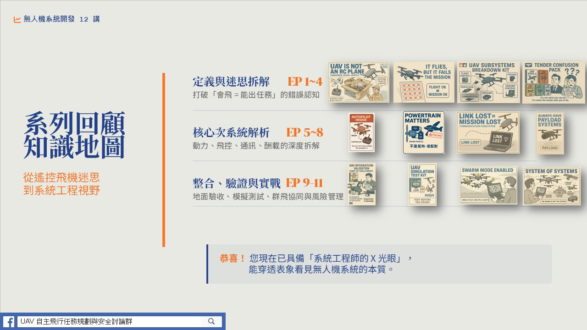

# 無人機系統開發 12 講｜droneDevTalk12

主講：**阿仁**（20 年無人機系統產業經驗，240+ 政府委託任務經驗）

本系列以建立「無人機系統建構的共通語言」為使命，從任務剖面、次系統、整合驗證一路講到產業終局。每一集底下包含當集的 PDF 講義、代表圖、以及內容大綱（README）。

## 一次看完｜YouTube 播放清單

(點選觀看完整播放清單)

## 集數索引

| 集數 | 主題 | 連結 |
|------|------|------|
| EP01 | 無人機不是會飛的玩具，是一整套任務方案 | [EP01/](EP01/README.md) |
| EP02 | 任務剖面：從需求到系統需求的鴻溝 | [EP02/](EP02/README.md) |
| EP03 | 系統需求展開與規格定義 | [EP03/](EP03/README.md) |
| EP04 | 甲乙丙丁戊型無人機與 Kill Chain 分析 | [EP04/](EP04/README.md) |
| EP05 | 飛控次系統 | [EP05/](EP05/README.md) |
| EP06 | 動力次系統 | [EP06/](EP06/README.md) |
| EP07 | 通訊次系統 | [EP07/](EP07/README.md) |
| EP08 | 光電酬載次系統 | [EP08/](EP08/README.md) |
| EP09 | 整合驗證：從規格到實戰的生存指南 | [EP09/](EP09/README.md) |
| EP10 | 模擬驗證：高效開發的數位雙生之道 | [EP10/](EP10/README.md) |
| EP11 | 群飛：從單機操作到系統作戰 | [EP11/](EP11/README.md) |
| EP12 | 無人機系統大未來：產業終局與戰略解碼 | [EP12/](EP12/README.md) |

## 致謝

僅以這集，紀念我的恩師——**國立成功大學 航空太空工程學系 講座教授 蕭飛賓 老師**。老師的研究與教學，啟發了台灣無人機系統開發的第一代核心人才。

## 授權

本作品採 **CC BY 4.0** 授權。歡迎引用、分享與二次創作，請標註：**阿仁 — 無人機系統開發 12 講**。

---

## 講者介紹｜阿仁

**成功大學航太系所畢業、資深嵌入式系統開發工程師**

- 20 年無人機系統開發、整合與任務實戰經驗，專注於無人機系統開發領域
- 親自執行 240+ 政府委託任務，監督上千次飛行任務，累積豐富的實戰經驗
- 2023–2024 年參與多個商規軍用無人機專案，協助團隊成功拿下標案
- 本系列內容源自真實產業經驗與任務萃取，不是書本理論，而是實戰精華

**FB**　[UAV 無人機任務規劃與安全討論群](https://www.facebook.com/groups/1215514938555547)
**聯繫**　f44831324@gs.ncku.edu.tw

---